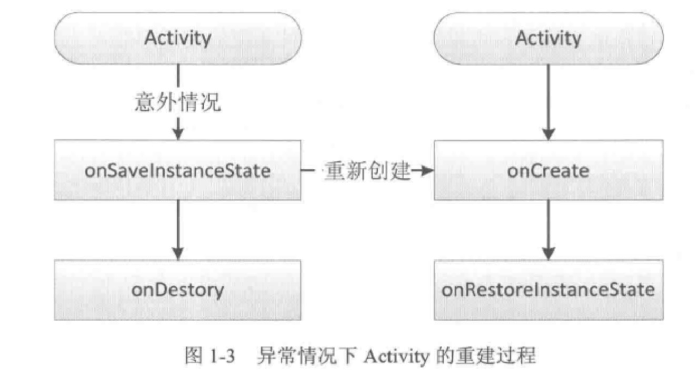

##### 1.1 Activity的生命周期
- 典型情况下的生命周期

    onCreate()  
    onStart()  
    onResume()  
    onPause()  
    onStop()  
    onDestroy()

- 异常情况下的生命周期  
  activity的配置发生改变时，会调用onSaveInstanceState()方法。

##### 1.2 Activity的启动模式
- **standard**
  
  标准启动模式，每次启动Activity都会重新创建一个实例。这种模式下，谁启动了Activity，就在谁的栈中，如果是非Activity的context启动Activity，那么必须添加FLAG_ACTIVITY_NEW_TASK标识。
        

- **singleTop**
  
  栈顶复用模式。当栈顶已经存在此activity时，那么activity不会重新创建实例，它会复用已存在的这个activity，并调用onNewIntent()方法，通过此方法可以取出传递的参数，不在栈顶则会创建新的实例。

- **singleTask**

  栈内复用模式。是一种栈内单例模式，当栈中存在此activity, 那么多次启动activity不会创建新的实例，会把已存在的activity已到栈顶，并且回调onNewIntent()方法。

- **singleInstance**

    单例模式。是singleTask的加强版，栈中只会存在一个activity, 只有栈被回收了才会重新创建实例。  

##### 1.3 Intent中的Flag
- Intent.FLAG_ACTIVITY_NEW_TASK
- Intent.FLAG_ACTIVITY_CLEAR_TOP
- Intent.FLAG_ACTIVITY_SINGLE_TOP
- Intent.FLAG_ACTIVITY_EXCLUDE_FROM_RECENTS